# Technical Design Document: URL Shortener

## Table of Contents
1. [Project Overview](#project-overview)
2. [Technology Stack](#technology-stack)
3. [System Architecture](#system-architecture)
4. [Backend Architecture](#backend-architecture)
5. [Frontend Architecture](#frontend-architecture)
6. [Database Schema](#database-schema)
7. [API Design](#api-design)
8. [Authentication & Authorization](#authentication--authorization)
9. [URL Shortening Flow](#url-shortening-flow)
10. [Deployment Architecture](#deployment-architecture)
11. [Security Considerations](#security-considerations)
12. [Performance Optimization](#performance-optimization)

---

## Project Overview

### Purpose
A modern URL shortening service that allows users to convert long URLs into short, shareable links. The application provides both anonymous and authenticated URL shortening with analytics tracking.

### Key Features
- **URL Shortening**: Convert long URLs to short codes (8 characters by default)
- **Custom Short Codes**: Users can specify custom short codes for their URLs
- **Click Tracking**: Track the number of clicks for each shortened URL
- **User Dashboard**: Authenticated users can view and manage their shortened URLs
- **URL Expiration**: Optional expiration dates for shortened URLs
- **Anonymous Access**: Non-authenticated users can create short URLs
- **User Authentication**: Login/Signup functionality using Django Allauth
- **Modern UI**: Responsive React-based interface with Tailwind CSS

### Target Users
- Marketing teams needing trackable links
- Social media managers requiring short URLs for posts
- Individuals wanting to share long URLs conveniently
- Developers needing programmatic URL shortening via API

---

## Technology Stack

### Backend Stack
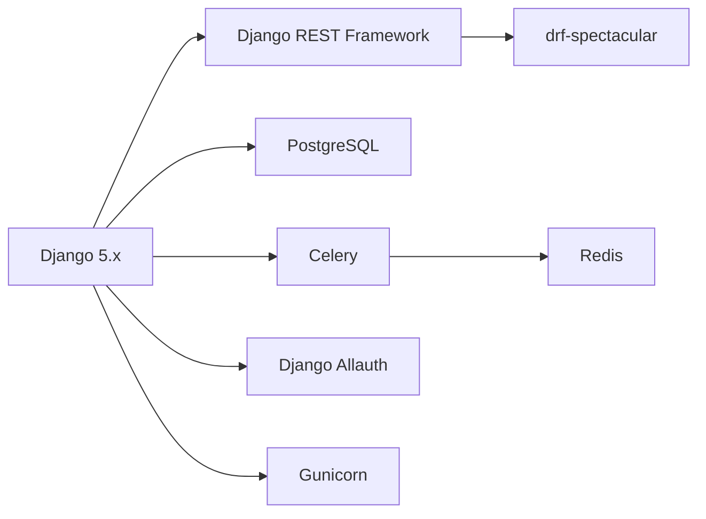

**Core Technologies:**
- **Django 5.x**: Web framework
- **Python 3.12**: Programming language
- **PostgreSQL**: Primary database
- **Django REST Framework**: API development
- **drf-spectacular**: OpenAPI schema generation
- **Django Allauth**: Authentication system
- **Celery**: Asynchronous task processing
- **Redis**: Cache and Celery broker
- **Gunicorn**: WSGI HTTP server
- **WhiteNoise**: Static file serving
- **Poetry**: Dependency management

**Security & Middleware:**
- django-defender: Brute force attack protection
- django-csp: Content Security Policy
- django-permissions-policy: Permissions Policy headers
- django-guid: Request correlation IDs

### Frontend Stack
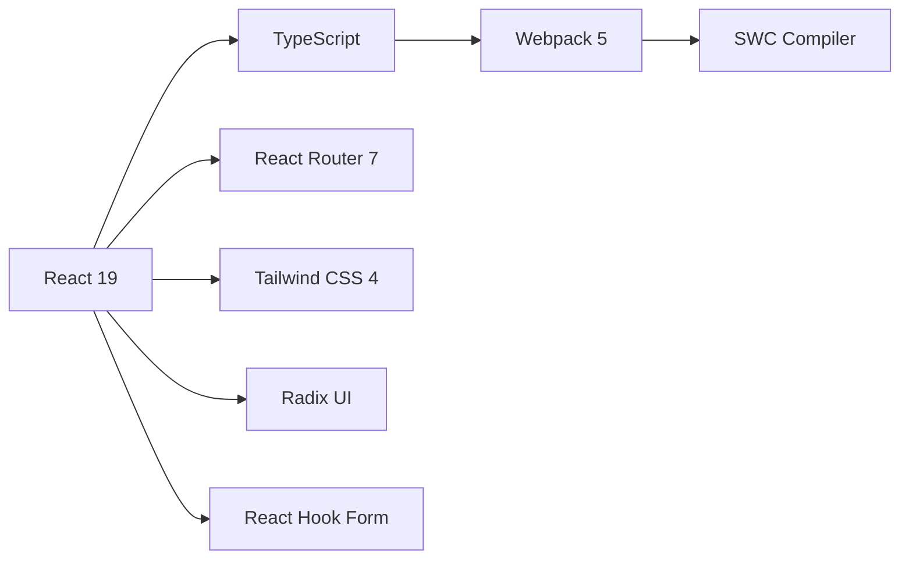

**Core Technologies:**
- **React 19**: UI library
- **TypeScript**: Type-safe JavaScript
- **React Router 7**: Client-side routing
- **Tailwind CSS 4**: Utility-first CSS framework
- **Webpack 5**: Module bundler
- **SWC**: Fast JavaScript/TypeScript compiler
- **Bun**: Fast JavaScript runtime and package manager

**UI Components & Libraries:**
- Radix UI: Accessible component primitives
- Lucide React: Icon library
- React Hook Form: Form management
- Zod: Schema validation
- shadcn/ui: UI component library

**Development Tools:**
- Biome: Linter and formatter
- Jest: Testing framework
- openapi-ts: TypeScript client generation

---

## System Architecture

### High-Level Architecture

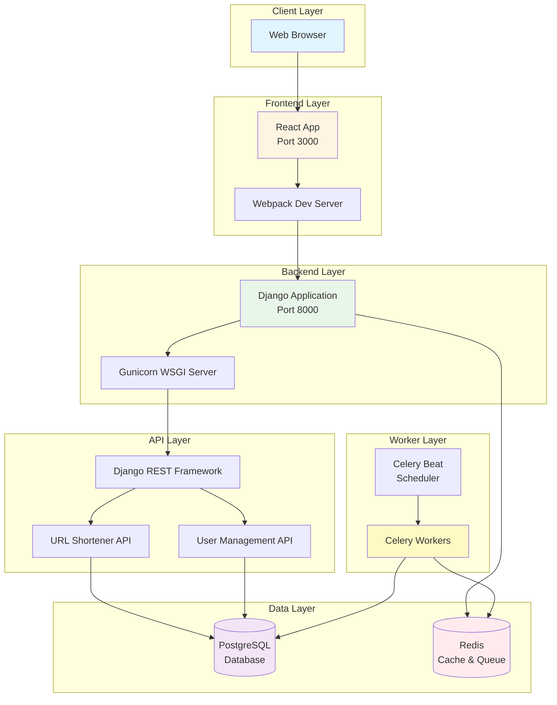

### Component Interaction Flow

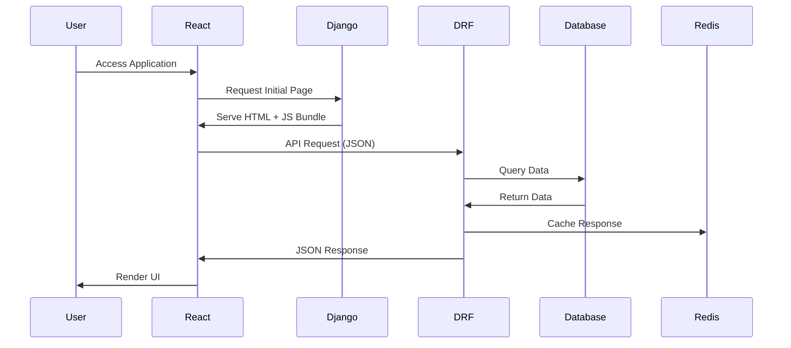

---

## Backend Architecture

### Django Project Structure

```
backend/
├── url_shortener/              # Django project root
│   ├── settings/
│   │   ├── base.py            # Base settings
│   │   ├── local.py           # Development settings
│   │   └── production.py      # Production settings
│   ├── urls.py                # URL routing
│   ├── wsgi.py                # WSGI configuration
│   └── celery.py              # Celery configuration
│
├── urlshortener/              # URL shortener app
│   ├── models.py              # ShortURL model
│   ├── views.py               # ViewSets & views
│   ├── serializers.py         # DRF serializers
│   ├── routes.py              # Router configuration
│   └── admin.py               # Admin interface
│
├── users/                      # User management app (Allauth)
│   ├── models.py
│   ├── views.py
│   ├── serializers.py
│   └── routes.py
│
└── common/                     # Shared utilities
    ├── models.py              # Base models
    ├── views.py
    └── utils/
```

### Backend Architecture Diagram

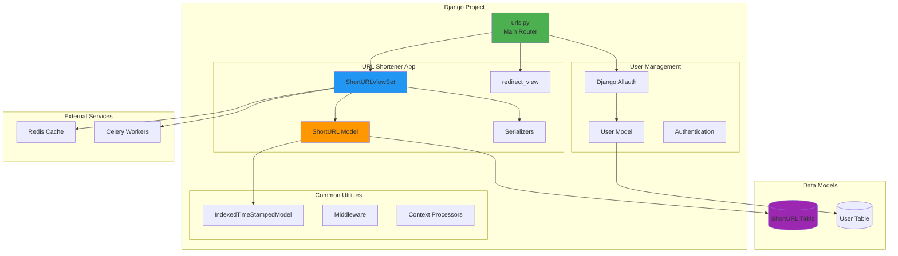

### Models Architecture

#### ShortURL Model

```python
class ShortURL(IndexedTimeStampedModel):
    """
    Core model for URL shortening
    Inherits: created, modified, id from IndexedTimeStampedModel
    """
    
    # Fields
    original_url: URLField        # Max 2048 characters
    short_code: CharField          # Unique, indexed, max 20 chars
    user: ForeignKey              # Optional user association
    click_count: PositiveIntegerField
    is_active: BooleanField
    expires_at: DateTimeField     # Optional expiration
    
    # Methods
    def save(): Generate unique short_code
    def increment_click_count(): Atomic counter update
    @property short_url: Return full short URL
```

**Database Indexes:**
1. Primary index on `short_code` (unique lookups)
2. Composite index on `(user, -created)` (user dashboard queries)

---

## Frontend Architecture

### React Application Structure

```
frontend/js/
├── App.tsx                    # Root component
├── index.tsx                  # Entry point
│
├── routes/
│   └── index.tsx              # Route configuration
│
├── pages/
│   ├── Home.tsx               # URL shortening form
│   ├── Dashboard.tsx          # User's URLs list
│   ├── Login.tsx              # Login page
│   └── Signup.tsx             # Signup page
│
├── components/
│   ├── Layout.tsx             # App layout wrapper
│   ├── TopNav.tsx             # Navigation bar
│   ├── ThemeToggle.tsx        # Dark/light mode
│   ├── ErrorBoundary.tsx      # Error handling
│   └── ui/                    # shadcn/ui components
│       ├── button.tsx
│       ├── card.tsx
│       ├── input.tsx
│       ├── table.tsx
│       └── ...
│
├── contexts/
│   ├── AuthContext.tsx        # Authentication state
│   └── ThemeContext.tsx       # Theme management
│
├── hooks/
│   ├── use-toast.tsx          # Toast notifications
│   └── use-mobile.ts          # Responsive detection
│
├── api/
│   └── client/                # Auto-generated API client
│       ├── types.gen.ts
│       └── index.ts
│
└── utils/
    ├── cn.ts                  # Class name utilities
    └── urls.ts                # URL helpers
```

### Frontend Component Architecture

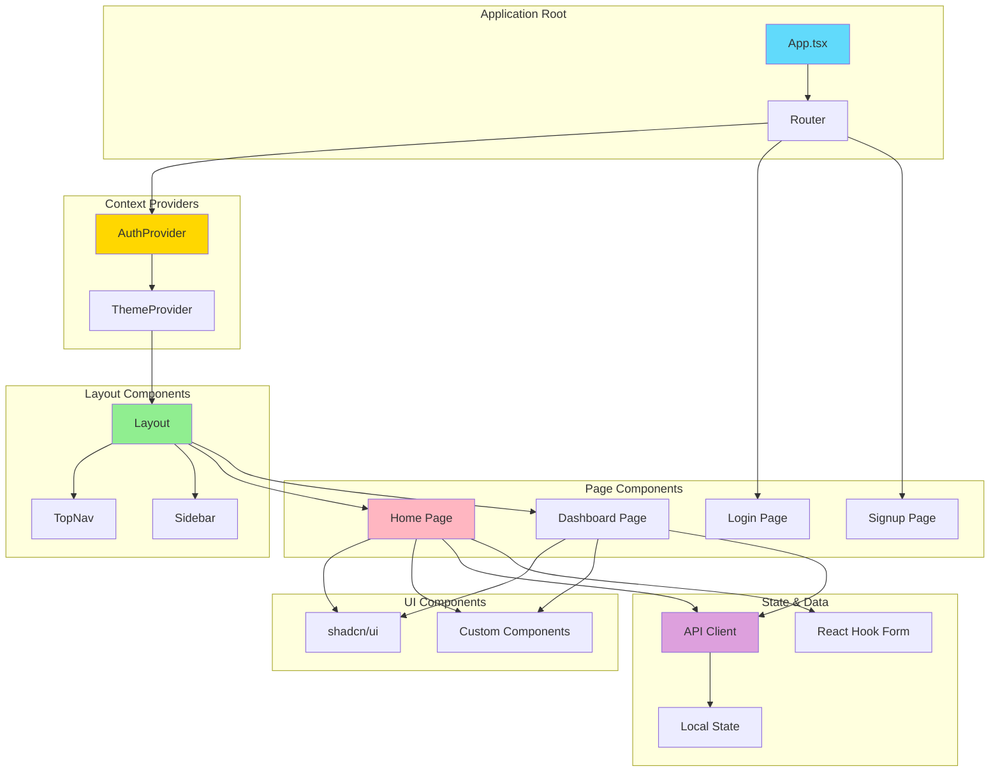

### Data Flow Pattern

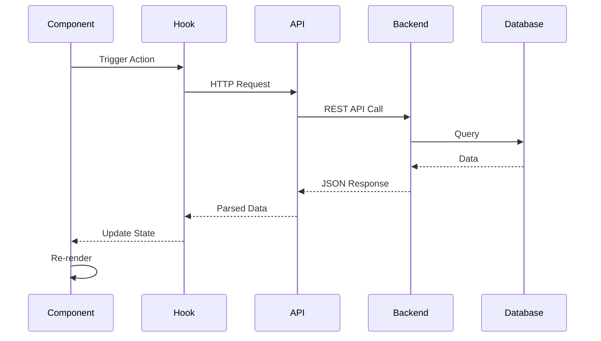

---

## Database Schema

### Entity Relationship Diagram

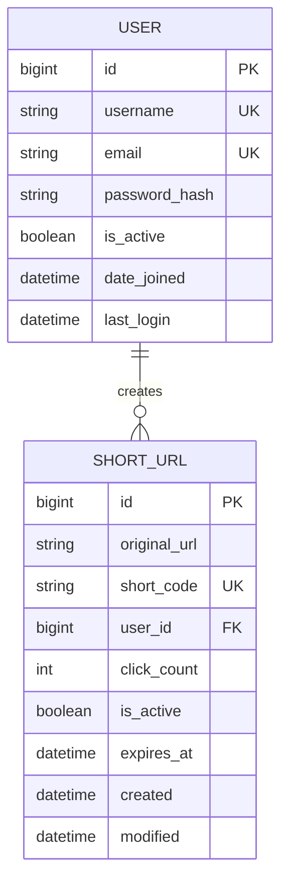

### Table Details

#### ShortURL Table
```sql
CREATE TABLE urlshortener_shorturl (
    id BIGSERIAL PRIMARY KEY,
    original_url VARCHAR(2048) NOT NULL,
    short_code VARCHAR(20) UNIQUE NOT NULL,
    user_id BIGINT REFERENCES auth_user(id) ON DELETE CASCADE,
    click_count INTEGER NOT NULL DEFAULT 0,
    is_active BOOLEAN NOT NULL DEFAULT true,
    expires_at TIMESTAMP WITH TIME ZONE,
    created TIMESTAMP WITH TIME ZONE NOT NULL,
    modified TIMESTAMP WITH TIME ZONE NOT NULL
);

-- Indexes
CREATE INDEX idx_short_code ON urlshortener_shorturl(short_code);
CREATE INDEX idx_user_created ON urlshortener_shorturl(user_id, created DESC);
```

#### Indexing Strategy
1. **Primary Key (id)**: Auto-incrementing identifier
2. **Unique Index (short_code)**: Fast lookups for redirects
3. **Composite Index (user_id, created)**: Optimized user dashboard queries
4. **Foreign Key (user_id)**: Optional user association with cascade delete

---

## API Design

### API Architecture

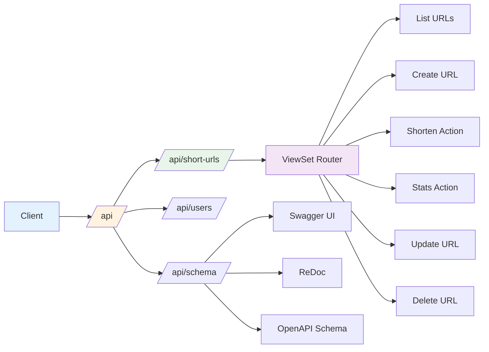

### REST API Endpoints

#### Short URL Endpoints

| Method | Endpoint | Auth Required | Description |
|--------|----------|---------------|-------------|
| `GET` | `/api/short-urls/` | Yes | List user's URLs (paginated) |
| `POST` | `/api/short-urls/` | No | Create short URL |
| `GET` | `/api/short-urls/{id}/` | Yes | Get specific URL details |
| `PATCH` | `/api/short-urls/{id}/` | Yes | Update URL properties |
| `DELETE` | `/api/short-urls/{id}/` | Yes | Delete short URL |
| `POST` | `/api/short-urls/shorten/` | No | Public shortening endpoint |
| `GET` | `/api/short-urls/{id}/stats/` | Owner | Get click statistics |
| `GET` | `/{short_code}/` | No | Redirect to original URL |

#### Request/Response Examples

**Create Short URL:**
```json
// POST /api/short-urls/shorten/
{
  "original_url": "https://example.com/very/long/url",
  "custom_code": "mylink",  // optional
  "expires_at": "2025-12-31T23:59:59Z"  // optional
}

// Response: 201 Created
{
  "id": 1,
  "original_url": "https://example.com/very/long/url",
  "short_code": "mylink",
  "short_url": "http://localhost:8000/mylink",
  "user": null,
  "user_email": null,
  "click_count": 0,
  "is_active": true,
  "expires_at": "2025-12-31T23:59:59Z",
  "created": "2025-11-02T10:30:00Z",
  "modified": "2025-11-02T10:30:00Z"
}
```

**List User URLs:**
```json
// GET /api/short-urls/
// Response: 200 OK
{
  "count": 25,
  "next": "/api/short-urls/?limit=10&offset=10",
  "previous": null,
  "results": [
    {
      "id": 1,
      "original_url": "https://example.com/page",
      "short_code": "abc123",
      "short_url": "http://localhost:8000/abc123",
      "click_count": 42,
      "created": "2025-11-01T10:00:00Z"
    }
  ]
}
```

**Get Statistics:**
```json
// GET /api/short-urls/1/stats/
// Response: 200 OK
{
  "short_code": "abc123",
  "original_url": "https://example.com/page",
  "click_count": 42,
  "created": "2025-11-01T10:00:00Z",
  "is_expired": false
}
```

### API Permissions Matrix

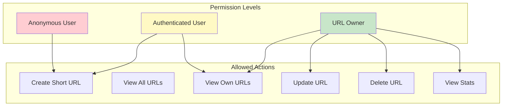

### OpenAPI Schema
- **Tool**: drf-spectacular
- **Documentation**: Available at `/api/schema/swagger-ui/` and `/api/schema/redoc/`
- **Schema Export**: `/api/schema/` (OpenAPI 3.0 JSON)
- **Client Generation**: TypeScript client auto-generated from schema

---

## Authentication & Authorization

### Authentication Flow

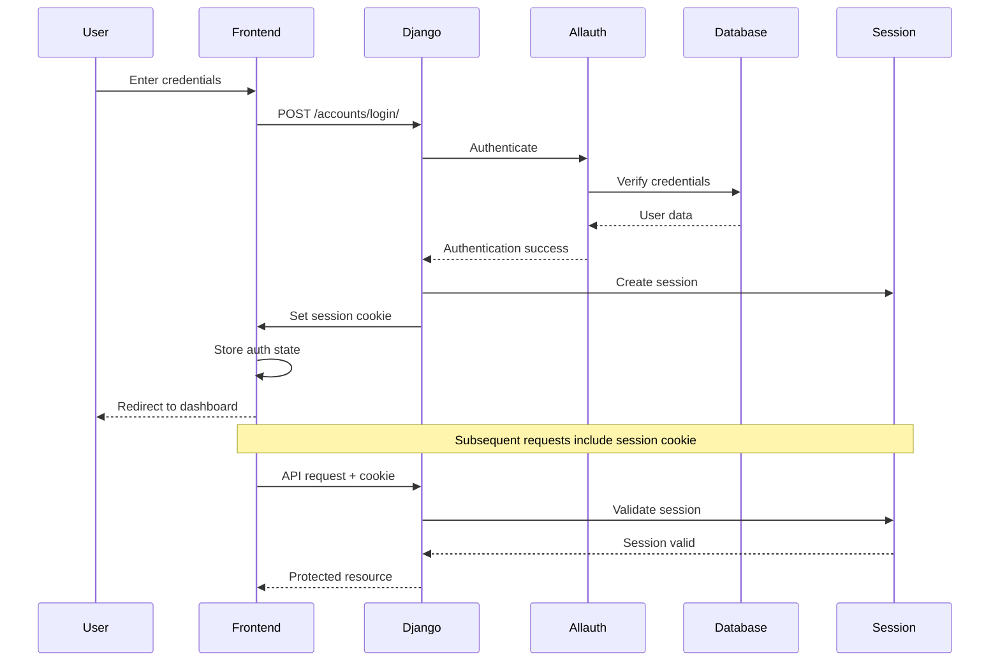

### Authorization Levels

**Anonymous Users:**
- Can create short URLs (not associated with account)
- Can access short URL redirects
- Cannot view URL list or statistics
- Cannot modify/delete URLs

**Authenticated Users:**
- All anonymous permissions
- Can view their own URLs in dashboard
- Can create URLs associated with their account
- Can update/delete their own URLs
- Can view statistics for their URLs

### Session Management
- **Backend**: Django session framework
- **Storage**: Database-backed sessions
- **Cookie**: `sessionid` (HttpOnly, SameSite=None for Safari compatibility)
- **CSRF**: CSRF token required for state-changing operations
- **Frontend**: AuthContext manages authentication state

### Authentication Providers
- **Email + Password**: Via Django Allauth
- **Username + Password**: Via Django Allauth
- **Social Auth**: Configurable (Google, GitHub, etc.) via Allauth

---

## URL Shortening Flow

### Short Code Generation Algorithm

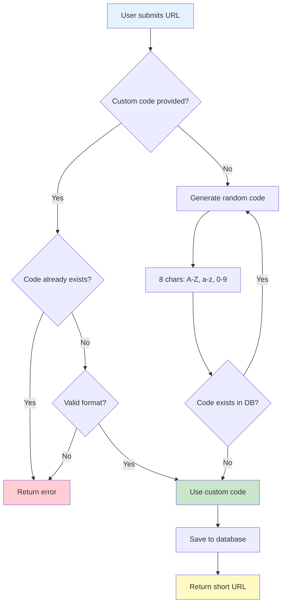

### URL Redirection Flow

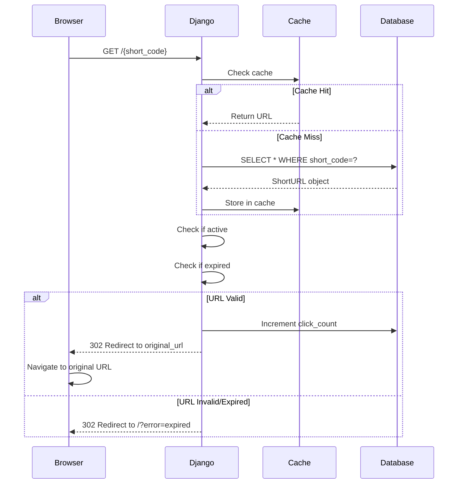

### Short Code Specifications
- **Length**: 8 characters (default)
- **Character Set**: `A-Z`, `a-z`, `0-9` (62 characters)
- **Total Combinations**: 62^8 = ~218 trillion unique codes
- **Collision Handling**: Loop until unique code found
- **Custom Codes**: User-provided, validated for uniqueness and format

### URL Validation Rules
1. Must be valid URL format (schema + domain)
2. Maximum length: 2048 characters
3. Short code must be alphanumeric only
4. Short code must be unique across all URLs

---

## Deployment Architecture

### Production Deployment on Render.com

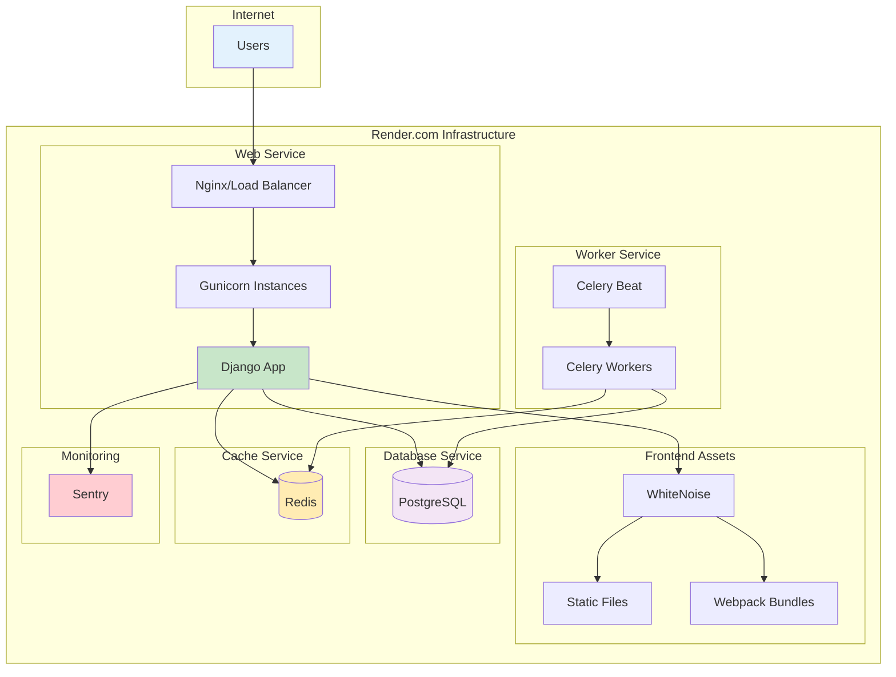

### Deployment Components

**Web Service:**
- **Server**: Gunicorn WSGI server
- **Workers**: Multiple worker processes
- **Static Files**: Served via WhiteNoise with Brotli compression
- **SSL/TLS**: Automatic HTTPS via Render

**Database:**
- **Type**: Managed PostgreSQL
- **Backups**: Automatic daily backups
- **Connection Pooling**: PgBouncer (managed by Render)

**Cache/Queue:**
- **Type**: Managed Redis
- **Usage**: 
  - Celery task queue
  - Session storage
  - Cache backend
  - Rate limiting (django-defender)

**Workers (Optional - Paid tier):**
- **Celery Workers**: Process background tasks
- **Celery Beat**: Scheduled task execution

**Monitoring:**
- **Sentry**: Error tracking and performance monitoring
- **Source Maps**: Automatically uploaded for JS debugging

### Build Process

```bash
# render_build.sh
1. Install Node dependencies (bun install)
2. Build frontend assets (bun run build)
3. Install Python dependencies (poetry install)
4. Generate OpenAPI schema
5. Run Django checks
6. Collect static files
7. Run database migrations
8. Upload Sentry source maps
```

### Environment Variables

**Required:**
- `DATABASE_URL`: PostgreSQL connection string
- `REDIS_URL`: Redis connection string
- `SECRET_KEY`: Django secret key (50+ chars)
- `ALLOWED_HOSTS`: Domain names

**Optional:**
- `SENTRY_DSN`: Sentry error tracking
- `SENTRY_ORG`, `SENTRY_PROJECT_NAME`, `SENTRY_API_KEY`: Source map uploads
- `SENDGRID_USERNAME`, `SENDGRID_PASSWORD`: Email sending

### Scaling Strategy

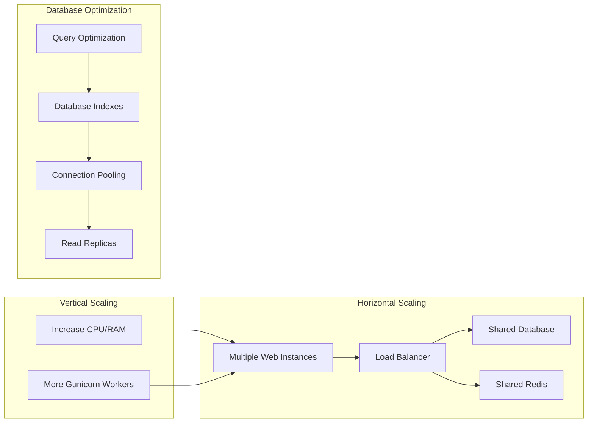

---

## Security Considerations

### Security Layers

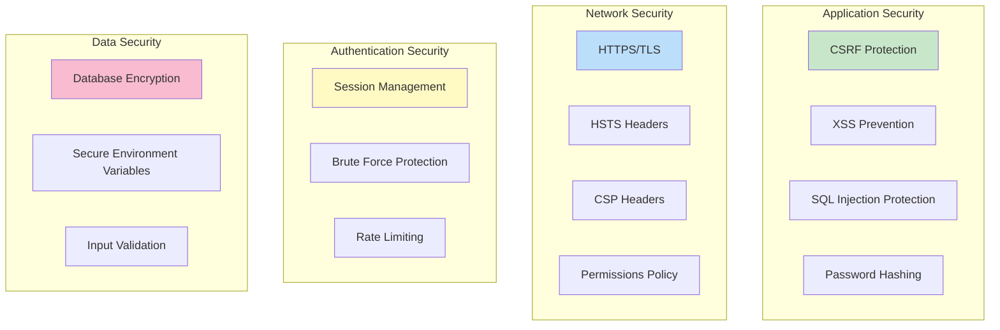

### Security Implementations

**1. Cross-Site Request Forgery (CSRF)**
- Django CSRF middleware enabled
- CSRF token required for all POST/PUT/DELETE requests
- Frontend includes CSRF token from cookie in requests

**2. Cross-Site Scripting (XSS)**
- React automatically escapes output
- Django template auto-escaping enabled
- Content Security Policy (CSP) headers configured
- Sanitization of user-generated content

**3. SQL Injection**
- Django ORM parameterized queries
- No raw SQL execution without sanitization
- Input validation via serializers

**4. Authentication Security**
- Passwords hashed using Django's default PBKDF2
- django-defender: Brute force attack protection (3 attempts → 5 min lockout)
- Session timeout configured
- Secure cookie flags (HttpOnly, Secure in production)

**5. Network Security**
- HTTPS enforced in production
- HSTS headers configured
- CSP headers restrict resource loading
- Permissions-Policy headers limit browser features

**6. Input Validation**
- URL validation: Schema, length, format
- Short code validation: Alphanumeric only, uniqueness check
- Django REST Framework serializer validation
- Zod schema validation on frontend

**7. Rate Limiting**
- Django Defender for login attempts
- Can add DRF throttling for API endpoints

**8. Security Headers**
```python
# Configured in settings
CSP_SCRIPT_SRC = ["'self'", "https://trusted-cdn.com"]
CSP_STYLE_SRC = ["'self'", "'unsafe-inline'"]
PERMISSIONS_POLICY = {
    "camera": [],
    "microphone": [],
    "geolocation": [],
}
```

---

## Performance Optimization

### Performance Strategy

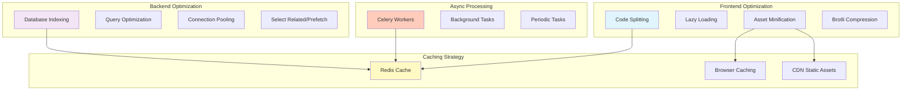

### Optimization Techniques

**1. Database Optimization**
- Indexes on `short_code` and `(user_id, created)` for fast lookups
- `select_related()` for user queries to avoid N+1
- Atomic operations for click count increments
- Connection pooling via PgBouncer

**2. Caching Strategy**
- Redis caching for frequently accessed URLs
- Browser caching for static assets (1 year)
- Django's `@cache_page` decorator for read-heavy views

**3. Frontend Performance**
- Webpack code splitting by route
- React lazy loading for non-critical components
- SWC compiler for faster builds
- Minified and compressed assets (Brotli)

**4. Static Asset Delivery**
- WhiteNoise serves static files
- Brotli compression (better than gzip)
- Long cache headers for versioned assets
- CDN can be added for global distribution

**5. Async Processing**
- Celery for background tasks
- Potential uses:
  - Bulk URL imports
  - Analytics aggregation
  - Link expiration cleanup
  - Email notifications

### Performance Metrics

**Target Metrics:**
- Homepage load: < 2 seconds
- URL creation: < 500ms
- Redirect lookup: < 100ms
- Dashboard load: < 1 second
- API response: < 200ms

**Monitoring:**
- Sentry Performance Monitoring
- Django Debug Toolbar (development)
- PostgreSQL query analysis
- Redis monitoring

---

## Appendix

### Development Workflow

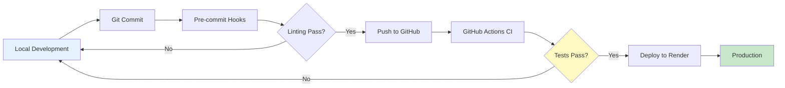

### Key Design Decisions

**1. Monorepo Structure**
- Frontend and backend in single repository
- Simplified deployment and versioning
- Shared configuration and tooling

**2. Django REST Framework + React**
- Clean API separation
- Type-safe frontend via OpenAPI generation
- Flexible for future mobile apps

**3. Session-based Authentication**
- Simpler than JWT for same-domain SPAs
- Secure HttpOnly cookies
- Django's built-in session management

**4. Optional User Association**
- Anonymous users can create URLs
- URLs can be claimed by authenticated users
- Lower barrier to entry

**5. Short Code Design**
- 8 characters = sufficient namespace
- Alphanumeric only for simplicity
- Custom codes for branding

### Future Enhancements

**Potential Features:**
- QR code generation for short URLs
- Link expiration notifications
- Bulk URL import/export
- Advanced analytics (geolocation, devices, referrers)
- Custom domains for short URLs
- Link preview/thumbnail generation
- API rate limiting per user
- URL categories and tags
- Link rotation (A/B testing)
- Slack/Discord webhooks for link clicks

### Technology Alternatives Considered

| Component | Chosen | Alternative | Reason |
|-----------|--------|-------------|--------|
| Backend Framework | Django | Flask, FastAPI | Full-featured, ORM, admin, auth |
| Frontend Framework | React | Vue, Svelte | Ecosystem, tooling, team familiarity |
| Database | PostgreSQL | MySQL, MongoDB | ACID compliance, JSON support, performance |
| API Framework | DRF | Django Ninja | Maturity, ecosystem, OpenAPI support |
| CSS Framework | Tailwind | Bootstrap, MUI | Utility-first, customization, size |
| Build Tool | Webpack | Vite, Rollup | Mature, plugin ecosystem |
| Package Manager | Bun | npm, pnpm | Performance, built-in tooling |

---

## Conclusion

This URL shortener application demonstrates a modern, production-ready architecture combining Django's robust backend capabilities with React's dynamic frontend. The system is designed for:

- **Scalability**: Database indexing, caching, and horizontal scaling support
- **Security**: Multiple layers of protection against common vulnerabilities
- **Performance**: Optimized queries, asset delivery, and caching strategies
- **Maintainability**: Clear separation of concerns, type safety, comprehensive documentation
- **User Experience**: Responsive UI, fast interactions, intuitive workflows

The architecture supports both current requirements and future enhancements while maintaining code quality and developer experience.

---

**Document Version**: 1.0  
**Last Updated**: November 2, 2025  
**Author**: Generated from codebase analysis  
**Project**: Django-React URL Shortener

